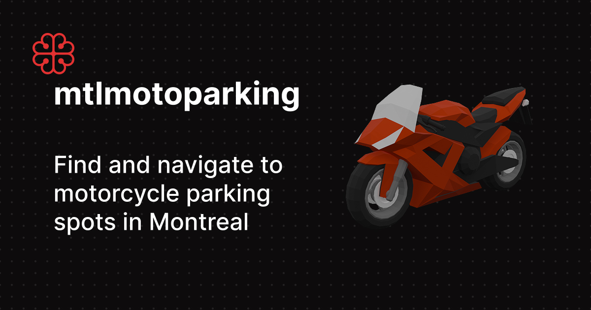

# mtlmotoparking



## What this is

Montreal has open data for motorcycle parking, but it is not always easy to use quickly when you are out riding. This project turns that data into a simple, map-first experience and adds lightweight community updates.

- Shows official motorcycle parking spots on an interactive map
- Lets you search by address and jump to nearby spots
- Displays spot details and recent community updates

## Stack

- Next.js (App Router) + React
- Maplibre + Mapbox search/reverse geocoding
- PostgreSQL (Neon) + Drizzle ORM
- better-auth (Google/Facebook)
- next-intl (en/fr)
- TailwindCSS + shadcn/Radix UI primitives

## Run locally

Prerequisites:

- [Bun](https://bun.sh)
- A PostgreSQL database (Neon is used in production)
- Mapbox token
- OAuth credentials (Google/Facebook) for auth flows

Setup:

```bash
cp .env.template .env
bun install
bun run dev
```

Then open [http://localhost:3000](http://localhost:3000).

## Data source

Parking data originates from Montreal's open data API and is normalized/upserted in the app. Address resolution uses Mapbox reverse geocoding.

## Contributing

Issues and PRs are welcome. If you want to work on a feature, opening a quick issue first helps avoid duplicated work.

## License

Released under the MIT License. See `LICENSE`.
